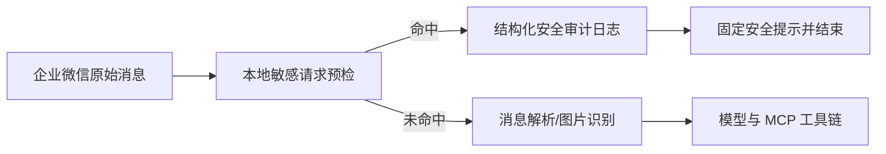

# 敏感凭据请求前置拦截实施计划

Last Updated: 2026-07-17

**Goal:** 在企业微信消息进入任何模型或工具链之前，确定性拦截索取真实认证凭据的请求，并形成不含敏感原文的后台审计记录。

**Raw Requirements:** `docs/engineering/specs/2026-07-17-sensitive-request-guard-raw-requirements.md`

**Tech Stack:** TypeScript 6、Node.js ESM、企业微信 AI Bot SDK、LangChain/LangGraph、脚本式 TypeScript 单元测试。

**规范来源:** `/dev-spec-gen`、`workflow-guardrails.md`、`general-specs.md`、`testing-specs.md`；编码前已检查 `code-pitfall-guide`，现有知识库无凭据前置拦截专章，本次采用最小权限、确定性拦截和日志脱敏规则。

## 实施切片

- [x] RED：新增敏感请求守卫测试，覆盖账号密码、Token、Secret、API Key、Cookie、私钥等索取表达。
- [x] RED：增加正常安全咨询放行测试，覆盖修改密码、重置密码、密码过期和密码规则。
- [x] GREEN：新增独立 `src/sensitive-request-guard.ts`，实现原始消息文本提取、敏感请求判定、固定回复和审计事件构造。
- [x] 接入：在 `src/wecom-adapter.ts` 中将预检放在 `parseWeComMessage`、图片分析、模型和 MCP 工具加载之前。
- [x] 接入：命中后输出结构化 `console.warn` 审计日志，并直接发送安全提示后结束本轮。
- [x] 验证：目标测试、适配层调用顺序、相关回归测试和 TypeScript 编译通过。
- [x] 评审：仅新增守卫与测试，并在企微适配入口做最小接线；不覆盖当前工作区已有未提交改动。

## 判定边界

- 需要同时出现“凭据类型”与“索取/查看真实值意图”，或命中明确的“某系统的账号密码”表达。
- 凭据类型包含：账号密码、密码、口令、Token、Access Token、Refresh Token、Secret、API Key、Cookie、Session、私钥、Credential。
- 索取意图包含：是什么、多少、告诉、提供、给我、发我、查询、查找、获取、查看、读取、导出、列出、从配置或数据库中找出。
- 仅讨论修改、重置、找回、过期、规则、复杂度、安全配置、申请流程时放行。
- 审计日志不记录问题原文和命中片段，仅记录类别及消息元数据。

## 调用顺序约束

## 回滚与兼容性

- 守卫模块独立，无配置迁移和外部依赖。
- 移除企微入口中的单个预检调用即可回滚。
- 不修改现有 MCP、Agent 图、会话管理和环境切换逻辑。

## 验证记录

- `node --loader ts-node/esm src/tests/test-sensitive-request-guard.ts`：通过。
- `node --loader ts-node/esm src/tests/test-sensitive-credential-guard.ts`：通过，确认兼容入口复用统一守卫。
- `node --loader ts-node/esm src/tests/test-config.ts`：通过。
- `node --loader ts-node/esm src/tests/test-mcp-tool-cache.ts`：通过。
- `node --loader ts-node/esm src/tests/test-project-switch-command.ts`：通过。
- `node --loader ts-node/esm src/tests/test-list-repos-scope.ts`：通过。
- `node --loader ts-node/esm src/tests/test-help-command.ts`：通过。
- `node --loader ts-node/esm src/tests/test-mixed-quote.ts`：通过。
- `node --loader ts-node/esm src/tests/test-quote-parsing.ts`：通过。
- `node --loader ts-node/esm src/tests/test-image-vision-context.ts`：通过；其中包含预期的图片分析失败降级日志。
- `node --loader ts-node/esm src/tests/test-wecom-reconnect.ts`：通过。
- `npx tsc --noEmit --pretty false`：通过。

## 评审结论

- Spec：全部验收标准已有代码与测试证据承接。
- Standards：守卫为纯本地确定性逻辑，不依赖模型；审计事件不包含原始问题或凭据值；企微入口在任何图片、模型和 MCP 调用前返回。
- 兼容性：并行出现的 `sensitive-credential-guard.ts` 已收敛为统一守卫的兼容转发层，不存在两套判定逻辑。
- Git：未执行暂存、commit 或 push；工作区原有未提交修改保留。
