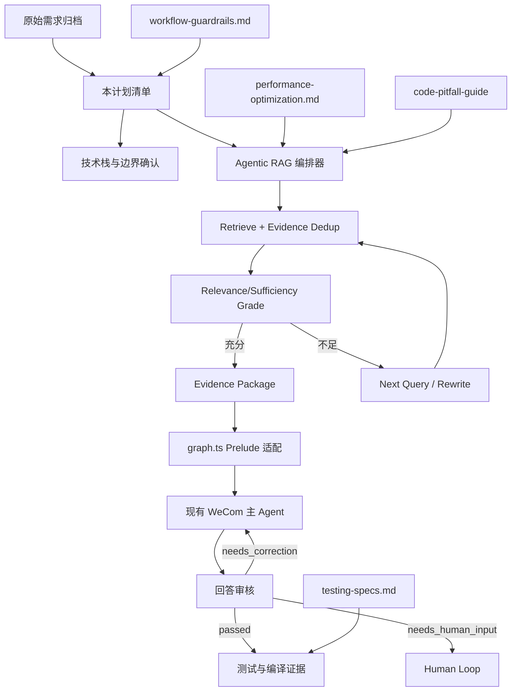
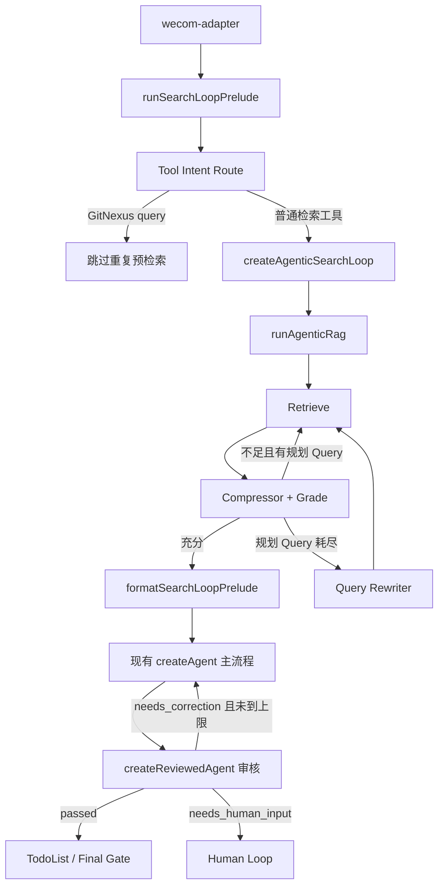

# Agentic RAG Search Loop Integration Plan

> **For agentic workers:** REQUIRED SUB-SKILL: Use superpowers:subagent-driven-development (recommended) or superpowers:executing-plans. 当前 DevSpace 运行时未暴露原生 superpowers/subagent 工具，本轮使用同一清单按 executing-plans 等价方式顺序执行，不创建并行 TODO。

**Last Updated:** 2026-07-10

**Goal:** 将现有 Minimal Search Loop 升级为可审计、有界、可改写的 Agentic RAG 检索闭环，并让最终回答审核失败时优先自动继续查证，避免把可自主完成的任务提前转成“回复继续”的 Human Loop。

**Architecture:** 采用“独立 Agentic RAG 编排器 + `graph.ts` 适配器 + 有界回答审核装饰器”。编排器只依赖注入的 planner/retriever/grader/rewriter，负责证据去重、相关性/充分性路由、补查、查询改写、循环预算和轨迹；`graph.ts` 将现有 SearchQuery、SearchResult、Compressor 适配到编排器，并恢复 `createReviewedAgent` 的“回答 -> 审核 -> 携带纠正意见重跑原 Agent”循环。企微适配层继续消费同一流式协议，只在纠正轮通过 `resetContent` 覆盖上一版内容；Human Loop 仅处理明确需要外部输入的场景。

**Tech Stack:** Node.js、TypeScript ESM、LangChain、LangGraph、MCP adapters、Zod、`node:assert` 脚本式测试、TypeScript compiler。

**Global Constraints:**

- 只做最小差异修改，不全局格式化。
- 不修改开始任务前已有的 8 个未提交文件。
- 保留 GitNexus `query` 自动预检索跳过策略，避免重复向量检索延迟。
- 不改变 MCP 工具输入输出契约、企微协议、配置结构和数据库/API 契约。
- 不自动 commit 或 push。
- 测试前只精确暂存本轮正式文件，禁止 `git add .`。

**Raw Requirements:** `docs/superpowers/specs/2026-05-20-minimal-search-loop-raw-requirements.md`

## 关联关系图

## Phase 0：启动、需求和架构确认

- [x] 读取 `/dev-spec-gen` 入口与 `workflow-guardrails.md`、`superpowers-integration-specs.md`、`general-specs.md`。（关注：流程护栏、计划融合、技术栈识别）
- [x] 读取 `backend-dev-specs.md`、`testing-specs.md`、`performance-optimization.md`。（关注：后端边界、正式测试、循环/远程调用性能）
- [x] 技术栈识别：`package.json`、`tsconfig.json` 证明为 Node.js + TypeScript ESM + LangChain/LangGraph。（`general-specs.md`）
- [x] Superpowers 6.x 兼容核对：当前 DevSpace 未暴露原生 superpowers 技能和子 Agent；本轮使用 executing-plans 等价顺序执行并记录该限制。（`workflow-guardrails.md`）
- [x] 原始需求归档并逐项映射到验收断言。（`workflow-guardrails.md`、raw requirements）
- [x] 架构模式确认：独立编排器 + 适配器，保留现有企微主链路；不重写完整 StateGraph。（`general-specs.md`）
- [x] API/DB/SQL 核对：本轮无接口字段、数据库、SQL、前端消费者变更，标记不适用。（`backend-dev-specs.md`、`api-specs.md`）
- [x] 分支与工作区核对：无 Jira ID；当前 `feature/search-iteration` 为现有检索迭代分支，不新建分支/worktree。（`workflow-guardrails.md`）
- [x] 工作区污染清单已记录；既有修改不覆盖、不暂存。（`workflow-guardrails.md`）
- [x] 编码前执行 `code-pitfall-guide`，生成并读取本轮修改规则；结论用于约束重复远程调用、证据去重和上下文规模。（`code-pitfall-guide/SKILL.md`）

## Phase 1：RED——Agentic RAG 编排器测试

**Files:**
- Create: `src/tests/test-agentic-rag.ts`

- [x] 测试“首轮证据充分”：只执行一次检索，直接进入 complete。（`testing-specs.md`：红黑测试、流程覆盖）
- [x] 测试“证据相关但不充分”：执行 Planner 的下一条未使用 Query。（`testing-specs.md`）
- [x] 测试“规划 Query 耗尽后改写”：调用 rewriter 并执行新 Query。（`testing-specs.md`）
- [x] 测试“重复/空改写 Query”：不再次检索，进入 bounded stop。（`testing-specs.md`）
- [x] 测试“重复证据去重”：相同 id/内容只保留一次。（`performance-optimization.md`：避免上下文放大）
- [x] 测试“最大迭代/改写次数”：严格停止并输出 stop reason。（`performance-optimization.md`）
- [x] 运行测试并记录 RED 失败证据：实现前执行时因 `../agentic-rag.js` 尚不存在而失败。（`superpowers:test-driven-development` 等价流程）

## Phase 2：GREEN——实现独立 Agentic RAG 编排器

**Files:**
- Create: `src/agentic-rag.ts`

- [x] 定义节点、状态、Grade、Trace、StopReason 和依赖注入接口。（`general-specs.md`：常量、可维护性）
- [x] 实现 Query 标准化与重复保护。（`performance-optimization.md`）
- [x] 实现证据稳定去重，保留首次来源顺序。（`performance-optimization.md`）
- [x] 实现 `plan -> retrieve -> grade -> next/rewrite -> complete/stop` 有界循环。（Agentic RAG 架构）
- [x] 实现 maxIterations、maxRewrites、无 Query、重复 Query、空改写等终止分支。（`testing-specs.md`：边界）
- [x] 运行 `src/tests/test-agentic-rag.ts`，输出 `[SUCCESS] agentic rag loop verified`。

## Phase 3：适配现有检索链路

**Files:**
- Modify: `src/graph.ts`
- Modify: `src/tests/test-search-loop-prelude.ts`

- [x] 新增 Agentic RAG Grade 适配：将 Compressor 输出转换为 relevant/sufficient/missingInfo/reason。（`general-specs.md`：复用现有能力）
- [x] 新增 Query rewriter 依赖入口；默认优先未执行 Planner Query，耗尽后才基于缺口改写。（Agentic RAG 架构）
- [x] `runSearchLoopPrelude` 改用新编排器，保持函数签名和调用方兼容。（`backend-dev-specs.md`：契约保护）
- [x] Prelude 增加执行轨迹、停止原因和改写 Query 摘要；不输出工具敏感参数。（`general-specs.md`）
- [x] 保留 GitNexus `query` skip 测试和行为。（历史性能约束）
- [x] 保留 `createMinimalSearchLoop` 导出及历史测试，避免破坏其他调用方。（公共契约保护）
- [x] 增加 Prelude 集成测试：验证 Grade 后补查和停止原因；重复/空 Query 保护由纯编排器测试覆盖。（`testing-specs.md`）

## Phase 4：测试、覆盖率和回归

- [x] 测试前回读 raw requirements，逐项核对计划、diff 和测试点。（`testing-specs.md`）
- [x] 列出本轮正式修改文件并执行精确暂存；`git diff --cached --name-only` 仅包含本轮 6 个正式文件。（`workflow-guardrails.md`）
- [x] 执行 `node --loader ts-node/esm src/tests/test-agentic-rag.ts`：通过。
- [x] 执行 `node --loader ts-node/esm src/tests/test-minimal-search-loop.ts`：通过。
- [x] 执行 `node --loader ts-node/esm src/tests/test-search-loop-prelude.ts`：通过。
- [x] 执行 `node --loader ts-node/esm src/tests/test-react-loop-control.ts`：通过，工具循环控制未回归。
- [x] 执行 `npx tsc --noEmit --pretty false`：通过。
- [x] 覆盖率：当前项目未集成 Jest/Vitest coverage；已用 8 组核心分支测试作为替代证据，无法提供数值化覆盖率，作为未验证风险记录。（`testing-specs.md`）
- [x] 验证中修改了严格类型兼容问题后，已重新精确暂存并复核暂存区。（`workflow-guardrails.md`）

## Phase 5：审核、文档和交付

- [x] 计划-代码一致性：每个验收断言均有实现、测试或明确不适用说明。（`general-specs.md`、`testing-specs.md`）
- [x] 代码审核点：默认最多 3 轮检索、1 次改写；证据按 id/内容去重；旧入口与 GitNexus skip 保留；改写失败以 bounded stop 交回主 Agent/Human Loop。（`performance-optimization.md`、`testing-specs.md`）
- [x] README 核对：安装、配置、启动命令和外部使用方式均未变化，本轮不修改 README。（`testing-specs.md`）
- [x] 已在计划和交付摘要中输出 Mermaid v8 兼容核心调用关系图。（`general-specs.md`）
- [x] 已在本计划验证证据和最终交付中记录验证命令、结果、未验证项和风险。（`testing-specs.md`）
- [x] 核对暂存区只包含本轮 6 个正式交付文件；未 commit、未 push。（`workflow-guardrails.md`）

## Phase 6：最终回答自动续查优化（2026-07-10 迭代）

**Files:**
- Modify: `src/graph.ts`
- Modify: `src/wecom-adapter.ts`
- Modify: `src/tests/test-answer-review.ts`
- Modify: `src/tests/test-final-reply-delivery.ts`
- Modify: 本计划与对应 raw requirements

- [x] 回读用户新增反馈并同步更新 raw requirements 与本计划，重新打开审核循环、Human Loop 和测试项。（`workflow-guardrails.md`：中途新增优化点熔断、原地迭代）
- [x] 技术栈与边界复核：Node.js + TypeScript ESM；无 API/DB/SQL/前端契约变更；README 使用方式不变。（`general-specs.md`、`backend-dev-specs.md`）
- [x] 架构模式复核：恢复已有 `createReviewedAgent` 装饰器能力，复用原 Agent 和工具流，不在适配层复制工具调用处理器。（`general-specs.md`：现有能力复用、公共契约保护）
- [x] 编码前执行 `code-pitfall-guide`，重点检查流式覆盖、重复工具调用、消息上下文放大、审核死循环和 Human Loop 误触发。（`code-pitfall-guide/SKILL.md`）
### 编码前避坑规则

- 审核与重跑必须串行执行，禁止并发启动多个业务 Agent。
- 只在 `needs_correction` 时重跑；`passed`、`needs_human_input`、`blocked` 立即停止，避免 Human Loop 误触发或死循环。
- 总轮次使用现有 `ANSWER_REVIEW_MAX_ROUNDS` 且硬上限为 5，不新增第二套无界重试参数。
- 纠正轮只追加上一版完整回答与结构化纠正要求，不回灌全部流式 chunk，避免上下文放大和消息格式失配。
- 默认审核轮次使用硬上限 5 轮，避免 2 轮配置过早进入兜底；仍禁止无界重试。
- 每轮纠正必须先穷尽现有 MCP、代码调用链、已保存证据和可访问 dev/test 数据路径，只有真实外部阻塞才转 Human Loop。
- 进入纠正轮先发送 `resetContent`，企微只保留最新版答案；审核进度不进入最终正文。
- Reviewer 超时或异常时停止内部重跑，交由既有最终闸门兜底，不把审核故障扩散为无限工具调用。

- [x] RED：更新 `test-answer-review.ts`，实现前物理失败于 reviewer 调用次数 `0 !== 1`，证明原实现没有执行审核和自动重跑。（`testing-specs.md`）
- [x] GREEN：实现 `createReviewedAgent` 有界审核循环；纠正轮携带原问题、上一版回答和审核要求，并发送 `resetContent + progress` 元数据。（`graph.ts`、`testing-specs.md`）
- [x] 调整最终兜底：`action="continue"` 不再生成“回复继续”或自动写入通用 Human Loop；只有明确 `human_loop` 才等待外部输入。（`wecom-adapter.ts`、`backend-dev-specs.md`）
- [x] 更新 `test-final-reply-delivery.ts`；修改前测试物理失败于旧文案仍包含“回复继续”，修改后验证自动续查耗尽文案和明确 Human Loop 文案均通过。（`testing-specs.md`）
- [x] 测试前逐项核对 raw requirements、计划、diff 和测试点；已确认工作区存在任务开始前的混合暂存/未暂存修改，本轮不改动现有 Git 暂存区，避免污染其他工作。（`workflow-guardrails.md`、`testing-specs.md`）
- [x] 执行定向测试、相关回归和 `npx tsc --noEmit --pretty false`，7 个测试入口及编译通过，失败数 0。（`testing-specs.md`）
- [x] 代码审核：审核循环仅在 `needs_correction` 时串行重跑，默认 2 轮、硬上限 5；Reviewer 超时/异常停止重跑；纠正时清空正文和旧流式快照；Human Loop 仅在明确外部阻塞时触发。（`testing-specs.md`、`performance-optimization.md`）
- [x] README 核对：安装、配置、启动和外部接口未变化，无需修改；计划、raw requirements、代码与测试已一致；未 commit、未 push。（`workflow-guardrails.md`、`general-specs.md`）

## Phase 7：默认续查深度与纠正指令强化（2026-07-10 迭代）

**Files:**
- Modify: `src/graph.ts`
- Modify: `src/tests/test-answer-review.ts`
- Modify: 本计划与对应 raw requirements

- [x] 原地回写新增反馈：默认 2 轮仍会过早触发有界兜底，且纠正提示容易让业务 Agent 提前转 Human Loop。（`workflow-guardrails.md`）
- [x] RED：新增默认配置测试，证明默认应执行到第 5 轮后通过；修改前物理失败为 `2 !== 5`。（`testing-specs.md`）
- [x] GREEN：将未配置 `ANSWER_REVIEW_MAX_ROUNDS` 时的默认值提升为 5，保留非法配置回退和硬上限 5。（`general-specs.md`、`performance-optimization.md`）
- [x] 强化纠正消息：先穷尽 MCP、代码、已保存证据和 dev/test 可访问路径，仅真实外部阻塞进入 Human Loop。（`general-specs.md`）
- [x] 执行回答审核定向测试、相关最终交付回归和 TypeScript 编译，全部通过。（`testing-specs.md`）
- [x] 复核 README 不适用、计划/代码/测试一致性及 Git 污染边界，不自动 commit/push。（`workflow-guardrails.md`）

## 验证证据

- RED：实现前执行 `node --loader ts-node/esm src/tests/test-agentic-rag.ts` 失败，原因是编排模块尚不存在。
- GREEN/回归：4 个测试入口全部通过，TypeScript `--noEmit` 编译通过，失败数 0。
- 测试覆盖场景：首轮充分、静态补查、动态改写、重复改写、空改写、证据去重、最大轮次、最大改写次数、Prelude 集成、GitNexus skip、旧 Minimal Search Loop、ReAct 控制回归。
- 暂存区文件：计划、原始需求、`src/agentic-rag.ts`、`src/graph.ts`、两份测试文件，共 6 个；任务开始前已有修改仍保持未暂存。
- 未验证风险：项目未配置 Jest/Vitest coverage，无法提供核心逻辑 80% 的物理覆盖率报告；默认 LLM Query Rewriter 和真实 Reviewer 模型调用均以注入测试验证控制流，未执行依赖远程模型与真实 MCP 服务的在线端到端验证。
- 自动续查 RED：实现前 `test-answer-review.ts` 失败于 reviewer 调用次数 `0 !== 1`；最终兜底修改前 `test-final-reply-delivery.ts` 失败于旧文案仍包含“回复继续”。
- 自动续查 GREEN/回归：`test-answer-review.ts`、`test-final-reply-delivery.ts`、`test-runtime-todolist.ts`、`test-progress-overwrite.ts`、`test-agentic-rag.ts`、`test-search-loop-prelude.ts`、`test-react-loop-control.ts` 全部通过，`npx tsc --noEmit --pretty false` 通过。
- 默认续查深度 RED：`test-answer-review.ts` 修改后执行，物理失败于默认轮次 `2 !== 5`。
- 默认续查深度 GREEN：默认轮次提升为 5 后，`test-answer-review.ts`、`test-final-reply-delivery.ts`、`test-runtime-todolist.ts` 和 TypeScript 编译全部通过；运行时 TodoList 测试按设计打印一次 `llm unavailable` fallback 日志，不影响成功结果。
- 提交前全量回归首次失败于 `test-business-prompt.ts` 的重复拼接文案断言；提示词已有两条真实约束，删除无效重复断言后重新执行完整回归。
- `test-runtime-todolist.ts` 会按用例设计打印一次 `llm unavailable` 的 fallback 日志，但测试结果通过，不属于本轮失败。
- Git 审计：工作区在本轮开始前已有混合暂存和未暂存修改；为避免改变用户现有暂存区，本轮只完成状态、diff 和暂存文件名核对，没有执行新增暂存、commit 或 push。

## 核心调用关系

## 迭代记录

- 2026-05-20：接入 Minimal Search Loop，使用静态 Planner Query + Compressor。
- 2026-07-10：原地升级为 Agentic RAG 编排器，引入显式 Grade、Query Rewrite、证据去重、Trace 和有界停止。
- 2026-07-10：新增最终回答自动续查迭代；审核判定可自主纠正时重跑原 Agent，取消通用“回复继续”兜底。
- 2026-07-10：新增默认续查深度优化；默认审核轮次由 2 提升至硬上限 5，并强化自主查证优先级。
