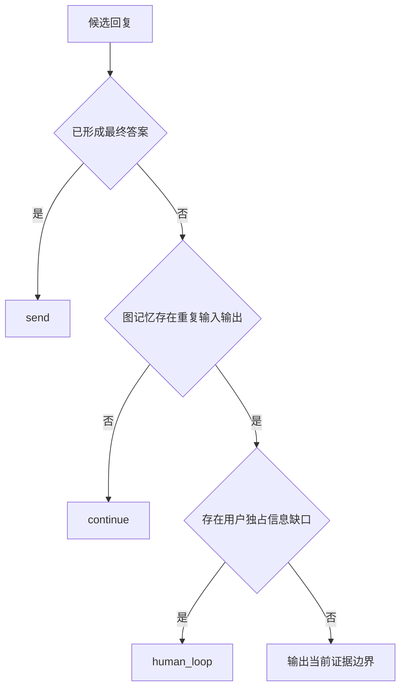

# wecom-agent 最终回复循环闸门计划

**Goal:** 未形成最终答案时持续自主检索；只有图记忆证明相同输入输出已重复，才允许进入 Human Loop。

**Tech Stack:** Node.js、TypeScript ESM、LangChain、现有脚本式 TypeScript 测试。

**Raw Requirements:** `docs/superpowers/specs/2026-07-08-wecom-final-answer-concise-raw-requirements.md`

**Skill / 规范来源:** `/dev-spec-gen`、`workflow-guardrails.md`、`general-specs.md`、`testing-specs.md`。本次需求明确，无需额外需求澄清 skill；采用现有最终回复闸门 seam，不新增架构层。

## 执行清单

- [x] RED：补充最终回复闸门测试，覆盖未重复拦截 Human Loop、重复允许 Human Loop、不同输入或输出不构成重复。重点关注 `tdd` 与 `testing-specs.md`。
- [x] GREEN：在 `src/runtime-todolist.ts` 增加图记忆输入输出重复检测与程序化 Human Loop 硬闸门。重点关注 `general-specs.md` 的最小修改原则。
- [x] 接入：在 `src/wecom-adapter.ts` 将当前轮开始前的会话图记忆快照传入最终回复解析，避免当前轮自身被误判为历史重复。
- [x] 旁路收口：显式 Human Loop JSON 和自然语言澄清转换均受重复输入输出条件限制。
- [x] 提示词：明确 Human Loop 必须同时满足“无最终答案、图记忆重复、用户独占缺口”。
- [x] 验证：精确暂存本次文件，`src/tests/test-runtime-todolist.ts` 与 `npx tsc --noEmit --pretty false` 均通过。
- [x] 审核：raw requirements、diff、测试与最终行为一致；README 不涉及使用方式变化，不适用。

## 边界场景

- 同一问题、同一候选回复在历史中已配对出现：视为重复。
- 同一问题、不同候选回复：不视为重复，继续推进。
- 不同问题、相同回复：不视为重复。
- 只有关键词重合、没有用户消息与后续 Agent 回复配对：不视为重复。
- 图记忆为空或已压缩但无法证明配对：默认不重复，返回 `continue`。

## 迭代记录

- 2026-07-14：新增图记忆输入输出重复判定，限制 Human Loop 的触发条件。
