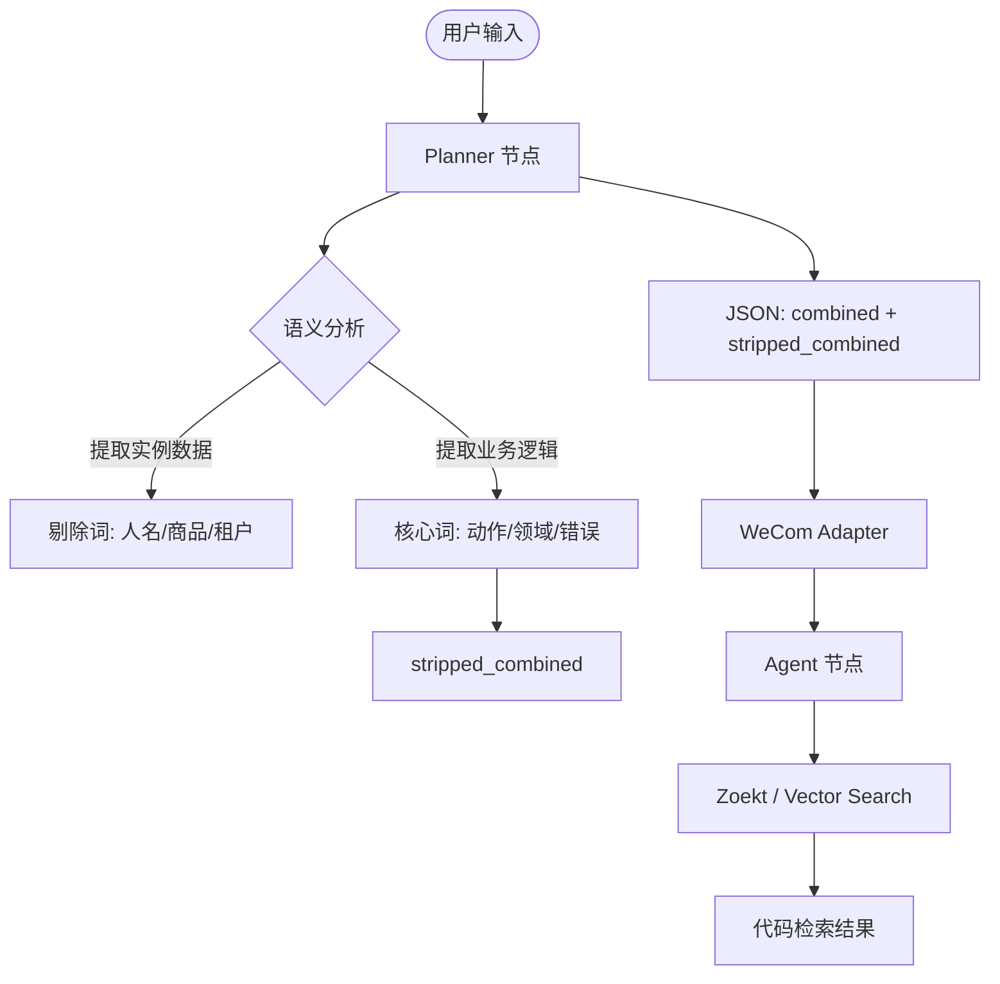

# 语义去噪与代码检索优化设计文档 (Semantic De-noising for Code Search)

## 1. 背景与目标
在用户通过企业微信与 AI 智能体交互时，问题往往包含具体的业务数据实例（如人名“张三”、具体商品名“iPhone 15”、租户名称“云南移动”等）。由于源代码库中仅包含业务逻辑和通用标识符，不包含这些具体的实例数据，直接将包含这些词的语句用于代码搜索（如 Zoekt）会导致搜索结果为空。

**目标**：在代码检索规划阶段，主动识别并剔除用户问题中的具体数据实例，生成仅包含业务逻辑词的“纯净版”检索指令，提高搜索召回率和准确性。

## 2. 核心逻辑变更

### 2.1 Planner 节点升级 (`planner-prompt.md`)
*   **输入识别**：增加对“实例数据”与“业务逻辑词”的区分能力。
*   **输出字段扩展**：
    *   `combined`: 原始提取的关键词组合（保留原始语义，用于上下文理解）。
    *   `stripped_combined`: **纯净版检索词**。必须剔除人名、商品名、租户名、特定单号等实例数据，仅保留动词、业务领域词、技术词。
*   **示例规范**：
    *   用户：“查一下**李四**的**订单**同步为什么失败”
    *   输出：`{"combined": "李四 订单 同步 失败", "stripped_combined": "订单 同步 失败 order sync fail"}`

### 2.2 适配器逻辑增强 (`wecom-adapter.ts`)
*   **提示词注入**：更新发送给 Agent 的【搜索规划建议】提示。
*   **显式红线**：明确告知 Agent 严禁将实例数据传入代码搜索工具。

### 2.3 业务指令更新 (`business-prompt.md`)
*   增加关于“代码检索词选择”的指导，引导 Agent 优先选择 Planner 提供的 `stripped_combined` 字段。

## 3. 架构设计

### 3.1 数据流图 (Mermaid)

## 4. 异常处理与降级
*   **无法区分时**：如果 Planner 无法确定某个词是否为实例数据，优先保留在 `combined` 中，并在 `stripped_combined` 中尝试提供一个不带该词的备选版本。
*   **搜索为空时**：Agent 应具备回退能力，如果 `stripped_combined` 搜索不到，尝试进一步精简词汇（如只搜核心动词）。

## 5. 测试与验证策略
*   **单元测试**：编写测试用例，涵盖包含人名、商品名、复杂租户名的各种提问场景，验证 Planner 输出的 `stripped_combined` 是否成功去噪。
*   **集成测试**：在企业微信端发送包含模拟数据的提问，通过日志确认 Agent 调用 `zoekt_search` 时使用的参数不含实例数据。
