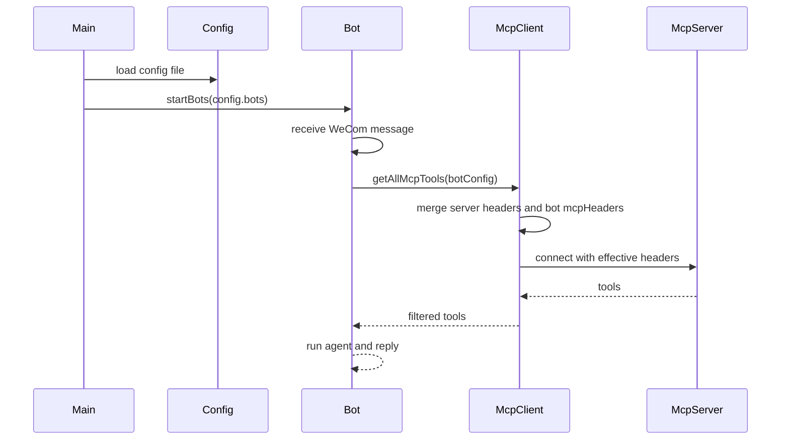

# 多机器人文件配置设计

## 背景

当前项目通过 `.env` 配置单个企业微信机器人，并用 `MCP_SERVERS` 环境变量承载 MCP server JSON 字符串。该方式在多机器人、多 MCP header 场景下可读性差，也无法表达“某个机器人只给指定 MCP server 注入特定 headers”。

本次需求直接废弃旧的单机器人环境变量配置，改为文件化 JSON 配置。真实配置文件使用 `${ENV_NAME}` 占位符引用 `.env` 或运行环境中的密钥。旧变量 `WECOM_BOT_ID`、`WECOM_BOT_SECRET`、`WECOM_WS_URL`、`LLM_*`、`MCP_SERVERS`、`ALLOWED_TOOLS`、`EXCLUDED_TOOLS` 不再作为固定运行配置入口，但可以作为占位符引用的环境变量名继续存在。

## 关键假设

- 配置文件默认路径为 `config/wecom-agent.config.json`。
- 可通过环境变量 `CONFIG_FILE` 覆盖配置文件路径。
- 真实 `config/wecom-agent.config.json` 不提交仓库；仓库提交 `config/wecom-agent.config.example.json`。
- 配置文件中的字符串值支持 `${ENV_NAME}` 占位符，启动时从 `.env` 或当前进程环境变量替换。
- 每个机器人独立连接企业微信 WebSocket。
- 每个机器人可以为指定 MCP server 覆盖或补充 headers。
- MCP server 默认 headers 仍然保留；机器人级 headers 与 server 默认 headers 合并时，机器人级同名字段优先。
- 工具白名单和黑名单保持全局配置，不做机器人级拆分。
- 本需求不涉及数据库、HTTP API、Java 热部署测试、接口 VO 字段变更。

## 配置结构

```json
{
  "llm": {
    "apiKey": "sk-xxx",
    "baseUrl": "${LLM_BASE_URL}",
    "modelName": "MiniMax-M2.5",
    "recursionLimit": 25,
    "contextWindow": 0
  },
  "mcpServers": [
    {
      "name": "gitnexus",
      "url": "http://ip:1348/sse",
      "type": "sse",
      "headers": {
        "projects": "project-a,project-b"
      }
    }
  ],
  "bots": [
    {
      "name": "robot-a",
      "botId": "bot-id",
      "secret": "${WECOM_ROBOT_A_SECRET}",
      "wsUrl": "wss://openws.work.weixin.qq.com",
      "mcpHeaders": {
        "gitnexus": {
          "x-project": "project-a",
          "x-robot": "robot-a"
        }
      }
    }
  ],
  "tools": {
    "allowed": [],
    "excluded": []
  }
}
```

## 组件设计

### `src/config.ts`

- 读取 `CONFIG_FILE`，未设置时读取 `config/wecom-agent.config.json`。
- 在 Zod 校验前递归解析字符串中的 `${ENV_NAME}` 占位符。
- 若占位符缺少对应环境变量，启动失败并提示缺失变量名。
- 使用 Zod 校验文件结构。
- 导出统一的 `config` 对象，字段包括 `llm`、`mcpServers`、`bots`、`tools`。
- 提供从机器人配置和 MCP server 配置合并 headers 的数据基础，不在配置层连接 MCP。

### `src/mcp-client.ts`

- 将 `getAllMcpTools()` 改为接受可选机器人配置参数。
- 对每个 MCP server 计算有效 headers：
  - `server.headers`
  - 加上 `bot.mcpHeaders[server.name]`
  - 机器人级同名 key 覆盖 server 级 key
- 工具过滤读取 `config.tools.allowed` 和 `config.tools.excluded`。

### `src/wecom-adapter.ts`

- 将 `startBot()` 调整为接收单个机器人配置。
- 新增 `startBots()`，遍历 `config.bots` 启动多个机器人。
- 每个消息处理链路使用当前机器人配置加载 MCP tools。
- 日志中包含机器人 `name`，便于区分多机器人运行状态。

### `src/index.ts`

- 从启动单机器人改为调用 `startBots()`。

### 文档与部署

- 新增 `config/wecom-agent.config.example.json`。
- 将 `config/wecom-agent.config.json` 加入 `.gitignore`，避免真实配置和密钥引用方式误提交。
- 更新 README 配置说明。
- 更新 Docker Compose，只保留 `CONFIG_FILE` 环境变量，并挂载配置目录。

## 数据流



## 验证目标

- 配置文件缺失时，启动失败并提示配置文件路径。
- 配置文件 JSON 格式错误时，启动失败并提示解析错误。
- 配置文件存在未定义的 `${ENV_NAME}` 时，启动失败并提示缺失变量名。
- 多个机器人配置存在时，`startBots()` 会为每个机器人启动连接。
- 指定机器人只对 `mcpHeaders` 中列出的 MCP server 注入 headers。
- 未列出的 MCP server 只使用 server 默认 headers。
- `npm run build` 或 `npx tsc --noEmit` 通过。
- 至少补充一个可本地执行的配置解析和 header 合并验证脚本。

## 规范核对

- `D:\workplace\skills\my-skills\dev-spec-gen\references\general-specs.md`：遵守最小化修改、保持原始风格、完成后输出调用关系和 Mermaid 流程图。
- `D:\workplace\skills\my-skills\dev-spec-gen\references\performance-optimization.md`：本需求不涉及批量查询、SQL、缓存、前端性能或大数据量循环处理。
- `D:\workplace\skills\my-skills\dev-spec-gen\references\java-specs.md`：本项目为 TypeScript/Node 项目，不涉及 Java 编译、AiAutoTestController、Mapper 或数据库验证。
