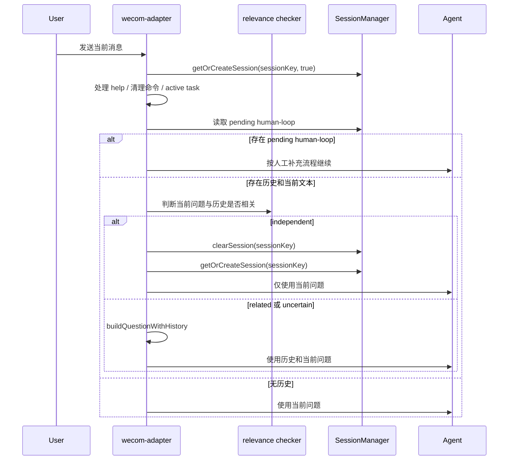

# wecom-agent 历史会话独立问题自动清理设计

## 背景

当前 `wecom-agent` 在收到新消息时，只要当前 `session.messages` 非空，就会把最近历史通过 `buildQuestionWithHistory` 拼入当前问题，并在调用 agent 时继续传入历史消息。这样虽然能支持追问，但当用户开启独立新问题时，旧历史已经进入模型上下文，可能污染仓库判断、工具选择和最终回答。

本次优化目标是：在代码层先判断当前问题是否独立；如果是独立问题，自动清空当前会话历史，再按新会话处理。

## 关键假设

- 用户选择“判断独立后自动清空会话”，而不是仅隔离本轮历史。
- 自动清空的范围与现有 `clearSession(sessionKey)` 一致：删除该 `sessionKey` 下的历史消息、repo hint、pending human-loop 等状态。
- 判断必须保守：不确定时优先保留历史，避免把真实追问误判为新问题。
- `/new`、`清理会话` 等现有显式清理命令仍然优先于自动判断。

## 设计方案

新增一个会话相关性判断函数，放在 `src/interaction-control.ts`，供 `wecom-adapter.ts` 在拼接历史前调用。

判断输出分三类：

- `related`：当前消息明显依赖历史，需要保留历史。
- `independent`：当前消息明显是独立新问题，需要自动清空会话。
- `uncertain`：无法可靠判断，按相关处理，保留历史。

自动清理只在 `independent` 时触发。清理后重新获取空 session，并使用当前问题继续后续处理，不再拼接旧历史，也不再把旧 `session.messages` 传入本轮 agent。

## 判断规则

优先级从高到低：

1. 显式继续类短语判为 `related`：
   - 例如：`继续`、`接着查`、`继续处理`、`往下查`、`go on`。
2. 显式新话题类短语判为 `independent`：
   - 例如：`新问题`、`另外一个问题`、`换个问题`、`重新开始`、`不要参考上文`。
3. 当前问题出现强新锚点，且与最近历史强锚点不一致，判为 `independent`：
   - Jira 编号：如 `XSWL-26474`。
   - 本地路径：如 `D:\workplace\typescript\GitNexus`。
   - 仓库或模块名：如 `wecom-agent`、`oa-order`。
   - 文件路径：如 `src/session-manager.ts`。
   - 接口路径：如 `/api/order/query`。
4. 当前问题是短追问或缺少主语，判为 `related`：
   - 例如：`怎么验证`、`继续下一步`、`为什么`、`那怎么改`。
5. 其它情况判为 `uncertain`，保留历史。

## 调用点

在 `src/wecom-adapter.ts` 中，当前逻辑位置是：

1. 先处理去重、命令、active task、help、显式清理命令。
2. 获取 `pendingHumanLoop`。
3. 在 `else if (session.messages.length > 0 && pendingText)` 分支拼接历史。

本次修改应在第 3 步之前插入判断：

- 如果存在 active pending human-loop，保持原流程，不做自动清理。
- 如果没有 pending human-loop，且存在历史消息和当前文本，则判断相关性。
- 若判断为 `independent`，调用 `sessionManager.clearSession(sessionKey)`，再重新获取 session，并继续使用当前问题。

## 错误处理

- 相关性判断函数必须是纯函数，不调用模型、不访问网络、不读写磁盘。
- 判断函数异常时不应影响主流程；调用方应按 `uncertain` 处理，保留历史。
- 自动清理应写日志，包含 `sessionKey`、判断原因和当前消息摘要，便于回归排查。

## 测试点

新增或扩展 TypeScript 脚本测试：

- 显式新话题会判为 `independent`。
- 显式继续会判为 `related`。
- 短追问会判为 `related`。
- 当前问题包含不同 Jira 编号时判为 `independent`。
- 当前问题包含不同仓库或路径锚点时判为 `independent`。
- 不确定场景判为 `uncertain`，调用方保留历史。
- 自动清理后，旧消息、repo hint、pending human-loop 不再保留。

## Mermaid 主流程

## 非目标

- 不引入数据库或 Redis 持久化。
- 不新增模型调用来判断相关性。
- 不改变现有 `/new` 或清理会话命令语义。
- 不调整整体上下文压缩策略。
